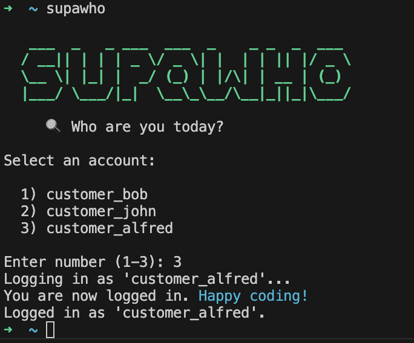

<div align="center">

<table>
<tr>
<td align="center" width="300">

</td>
<td align="center" width="400">

</td>
</tr>
</table>

Switch between multiple **Supabase** accounts in seconds.<br>
Tokens are stored securely in **macOS Keychain**.

<br>

[](#)
[](#)
[](#-installation)
[](LICENSE)

</div>

<br>

## 🍺 Installation

```bash
brew install EliaTolin/tap/supawho
```

<details>
<summary>🔧 Other installation methods</summary>

<br>

**Shell** (one-liner):

```bash
curl -fsSL https://raw.githubusercontent.com/EliaTolin/supawho/main/install.sh | bash
```

Install a specific version:

```bash
curl -fsSL https://raw.githubusercontent.com/EliaTolin/supawho/main/install.sh | bash -s 1.0.0
```

**Manual:**

```bash
git clone git@github.com:EliaTolin/supawho.git
chmod +x supawho/supawho
```

Add to your shell config (`~/.zshrc` or `~/.bashrc`):

```bash
echo 'alias supawho="/path/to/supawho/supawho"' >> ~/.zshrc
source ~/.zshrc
```

</details>

<br>

## 🔑 Getting your Supabase Access Token

1. Open [**supabase.com/dashboard**](https://supabase.com/dashboard) and click your **profile icon** (top right)
2. Select **Account preferences**
3. Go to **Access Tokens** in the left sidebar
4. Click **Generate new token**, give it a name and copy the token

> 💡 The token starts with `sbp_` and is shown **only once** — make sure to copy it!

Then save it:

```bash
supawho add myproject sbp_xxxxxxxxxxxxx
```

<br>

## 🚀 Usage

| Command | Description |
|---------|-------------|
| `supawho` | Interactive account picker |
| `supawho add <name> <token>` | Save a new account |
| `supawho use <name>` | Switch to an account |
| `supawho list` | Show all saved accounts |
| `supawho remove <name>` | Delete an account |

### Interactive mode

Just run `supawho` with no arguments:

```
   ___  _   _ ___  ___  _    _ _  _  ___
  / __|| | | | _ \/ _ \| |  | | || |/ _ \
  \__ \| |_| |  _/ (_) | |/\| | __ | (_)
  |___/ \___/|_|  \__\_\__/\__|_||_|\___/

     🔍 Who are you today?

Select an account:

  1) myproject
  2) another-project

Enter number (1-2):
```

<br>

## 🔒 Why is it secure?

Your tokens **never touch the filesystem**. They are stored exclusively in the **macOS Keychain**, the same encrypted vault that Safari and the system use for passwords and certificates.

| | supawho | Plain text files |
|---|:---:|:---:|
| Encrypted at rest | ✅ | ❌ |
| Protected by system login | ✅ | ❌ |
| Visible to other processes | ❌ | ✅ |
| Survives accidental `git add .` | ✅ | ❌ |

<br>

## 📋 Requirements

- **macOS** — uses the `security` command for Keychain access
- [**Supabase CLI**](https://supabase.com/docs/guides/cli) — installed and available in `$PATH`

<br>

## 📄 License

[MIT](LICENSE) — Made with 💚 by [Elia Tolin](https://github.com/EliaTolin)
