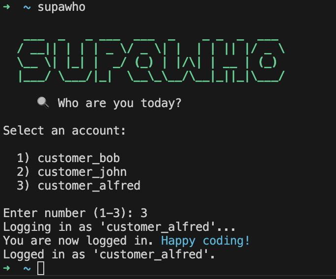

<div align="center">

<table border="0">
<tr>
<td align="center" width="300">

</td>
<td align="center" width="400">

</td>
</tr>
</table>

# supawho

### Switch between multiple **Supabase** accounts in seconds — on any OS.

Your access tokens live in your operating system's **native secret vault**, never on disk.<br>
One command to jump between projects and clients. 🔍

<br>

[](https://github.com/EliaTolin/supawho/releases)
[](#)
[](LICENSE)

[](#-installation)
[](#-installation)
[](#-installation)

</div>

<br>

> ### Juggling multiple Supabase accounts?
> Tired of the endless `supabase logout` → `supabase login` → paste token dance every time you switch project or client?
>
> **supawho** saves each account once and lets you jump between them in seconds — securely, with **no tokens on disk**.

<br>

## ✨ Why supawho

| | |
|---|---|
| 🔐 **Secure by design** | Tokens live in the OS keychain — encrypted, never written to a file |
| 🖥️ **Truly cross-platform** | One static binary for macOS, Linux and Windows. No runtime to install |
| ⚡ **Instant switching** | `supawho use client-a` and you're logged in |
| 🔄 **Self-updating** | `supawho upgrade` keeps you current on any OS |
| 🍺 **Installs everywhere** | Homebrew, `.deb`/`.rpm`/`.apk` packages, or a one-line script |

<br>

## 📦 Installation

Pick your platform — every option gives you the same single, dependency-free binary.

### 🍎 macOS

```bash
brew install EliaTolin/tap/supawho
```

<details>
<summary>Prefer a script or a raw binary?</summary>

<br>

```bash
curl -fsSL https://raw.githubusercontent.com/EliaTolin/supawho/main/install.sh | bash
```

Or grab the `Darwin` archive from the [releases page](https://github.com/EliaTolin/supawho/releases) and drop the binary in your `PATH`.

</details>

### 🐧 Linux

```bash
curl -fsSL https://raw.githubusercontent.com/EliaTolin/supawho/main/install.sh | bash
```

<details>
<summary>Native packages (<code>.deb</code> / <code>.rpm</code> / <code>.apk</code>)</summary>

<br>

Download the package for your distro from the [releases page](https://github.com/EliaTolin/supawho/releases), then:

```bash
# Debian / Ubuntu
sudo dpkg -i supawho_*_Linux_x86_64.deb

# Fedora / RHEL
sudo rpm -i supawho_*_Linux_x86_64.rpm

# Alpine
sudo apk add --allow-untrusted supawho_*_Linux_x86_64.apk
```

> ℹ️ Linux needs a Secret Service provider (GNOME Keyring, KWallet, …) running to store tokens.

</details>

### 🪟 Windows

```powershell
irm https://raw.githubusercontent.com/EliaTolin/supawho/main/install.ps1 | iex
```

<details>
<summary>Prefer the raw binary?</summary>

<br>

Download `supawho_*_Windows_x86_64.zip` from the [releases page](https://github.com/EliaTolin/supawho/releases), extract `supawho.exe`, and add it to your `PATH`.

</details>

### 🛠️ From source

Requires [Go](https://go.dev/dl/) 1.25+:

```bash
git clone https://github.com/EliaTolin/supawho.git
cd supawho
go install .
```

<br>

## 🔑 Get your Supabase access token

1. Open [**supabase.com/dashboard**](https://supabase.com/dashboard) → **profile icon** (top right)
2. **Account preferences** → **Access Tokens**
3. **Generate new token**, name it, and copy it

> 💡 The token starts with `sbp_` and is shown **only once** — copy it right away.

Then save it:

```bash
supawho add myproject sbp_xxxxxxxxxxxxx
```

<br>

## 🚀 Usage

| Command | Description |
|---|---|
| `supawho` | Interactive account picker |
| `supawho add <name> <token>` | Save a new account |
| `supawho use <name>` | Switch to an account |
| `supawho list` | Show all saved accounts |
| `supawho rename <old> <new>` | Rename a saved account |
| `supawho remove <name>` | Delete an account |
| `supawho upgrade` | Update to the latest version |

### Interactive mode

Just run `supawho` with no arguments:

```
   ___  _   _ ___  ___  _    _ _  _  ___
  / __|| | | | _ \/ _ \| |  | | || |/ _ \
  \__ \| |_| |  _/ (_) | |/\| | __ | (_)
  |___/ \___/|_|  \__\_\__/\__|_||_|\___/

     🔍 Who are you today?

Select an account:

  1) myproject
  2) another-project

Enter number (1-2):
```

<br>

## 🔄 Keeping supawho up to date

supawho tells you when a new version ships, and updates itself with one command:

```bash
supawho upgrade
```

It downloads the latest release, **verifies its checksum**, and swaps the binary in place. If supawho was installed through a package manager, it won't fight it — it points you to the right command instead:

| Installed via | How it updates |
|---|---|
| Homebrew | `brew upgrade supawho` |
| Install script / raw binary | `supawho upgrade` |
| `.deb` / `.rpm` / `.apk` | your system package manager |

> Prefer silence? Set `SUPAWHO_NO_UPDATE_CHECK=1` to disable the background version check.

<br>

## 🔒 Why is it secure?

Your tokens **never touch the filesystem**. They live in your operating system's native secret store — the same encrypted vault the OS uses for passwords and certificates:

- **macOS** → Keychain
- **Linux** → Secret Service (GNOME Keyring / KWallet, via `libsecret`)
- **Windows** → Credential Manager

| | supawho | Plain-text files |
|---|:---:|:---:|
| Encrypted at rest | ✅ | ❌ |
| Protected by system login | ✅ | ❌ |
| Hidden from other processes | ✅ | ❌ |
| Survives an accidental `git add .` | ✅ | ❌ |

<br>

## 📋 Requirements

- **macOS**, **Linux**, or **Windows** — a single static binary, no runtime to install
  - On Linux, a Secret Service provider must be running (GNOME Keyring, KWallet, …)
- [**Supabase CLI**](https://supabase.com/docs/guides/cli) — installed and available in your `PATH`

<br>

## 🛠 Troubleshooting

**`Account not found` when running `supawho use`**
Run `supawho list` to check the exact name — account names are case-sensitive.

**The token stops working after switching**
Confirm it's still valid in [Supabase Dashboard → Access Tokens](https://supabase.com/dashboard/account/tokens), then re-add the account with a fresh one: `supawho add <name> <token>`.

**Linux: `Cannot create an item in a locked collection`**
Your keyring is locked or no Secret Service is running. Unlock your login keyring (GNOME Keyring / KWallet) and try again.

**`supawho upgrade` says it's managed by a package manager**
That's on purpose — update through the manager you installed it with (see the table above).

<br>

## 📄 License

[MIT](LICENSE) — Made with 💚 by [Elia Tolin](https://github.com/EliaTolin)
